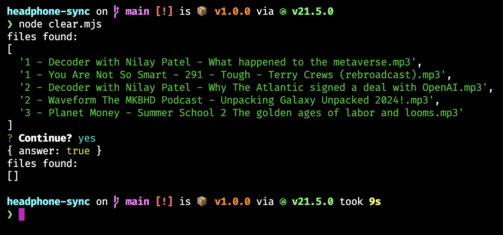
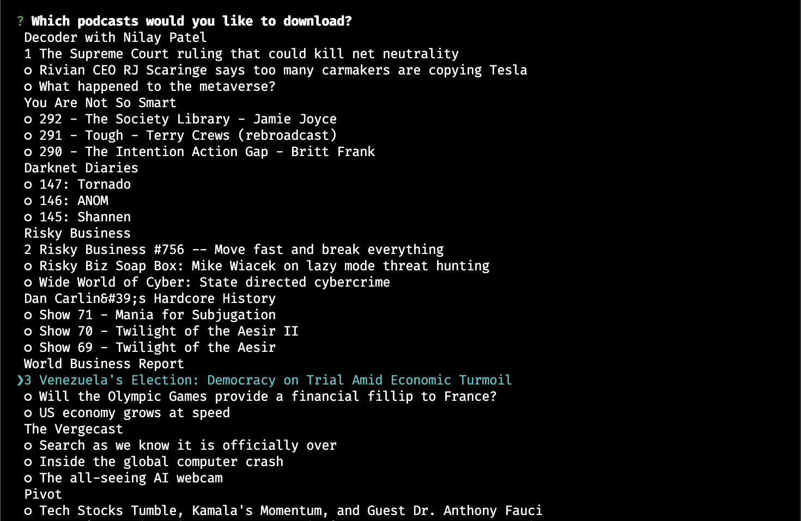
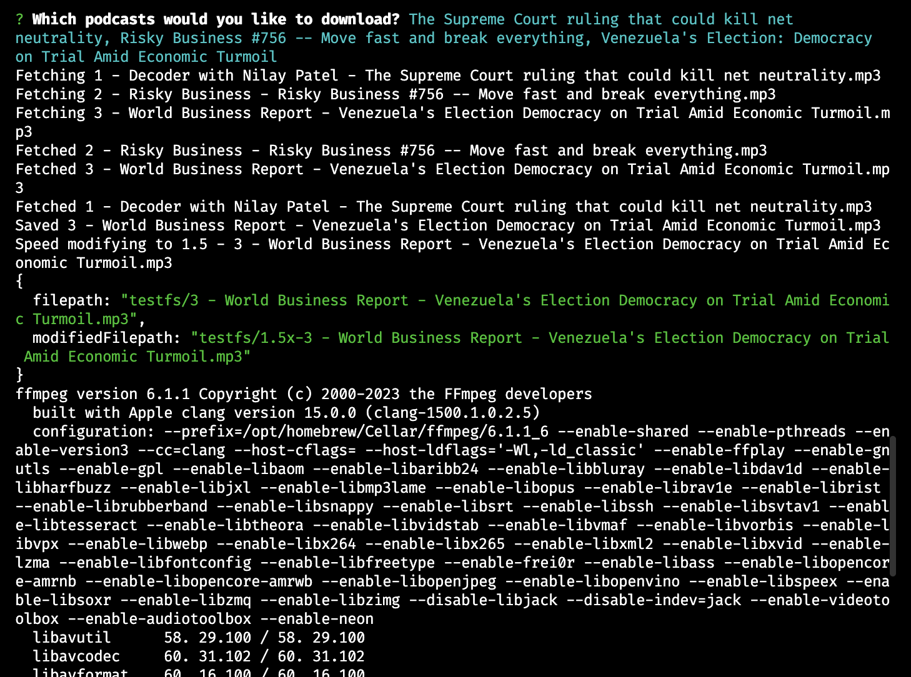
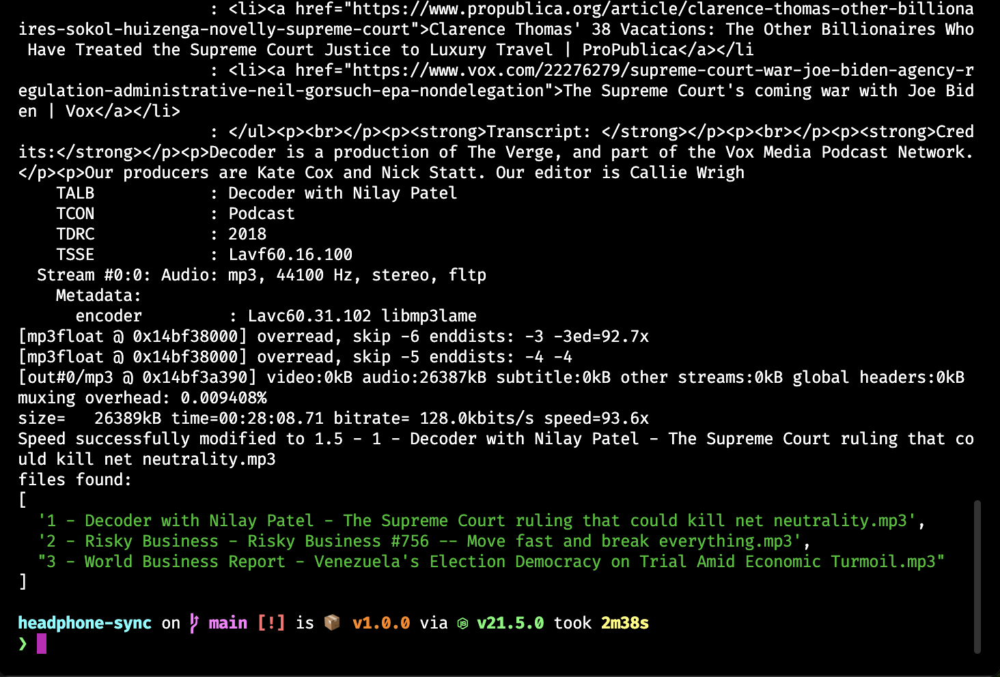

# Headphone sync tool

Homemade apps - this CLI acts as a media library manager for my waterproof headphones which are a basic USB file system. Download podcast mp3s and put them on the device.

## Instructions

1. Have ffmpeg installed, available to Node/command line
1. `pnpm install`
1. Create `.env` with `STORE=/drive/location`
1. `node clear.mjs` clear the store drive
1. `node append.mjs` and follow instructions
   - When presented with podcast titles, use number keys to control playback order

## Screenshots

Delete all items in the storage folder

Present user with podcast titles available for download. Note the numbered ordering.

Fetch files and use ffmpeg to increase playback speed to 1.5x

Final output, listing files on storage drive

